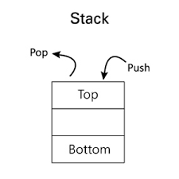

# Stack Data Structure:
A Stack is a linear data structure that follows a particular order in which the operations are performed. The order may be LIFO(Last In First Out) or FILO(First In Last Out). LIFO implies that the element that is inserted last, comes out first and FILO implies that the element that is inserted first, comes out last.
<h1 align="center">STACK</h1> 
  

# What is Stack Data Structure?
A stack is a linear data structure that follows the Last-In-First-Out (LIFO) principle. It behaves like a stack of plates, where the last plate added is the first one to be removed.
